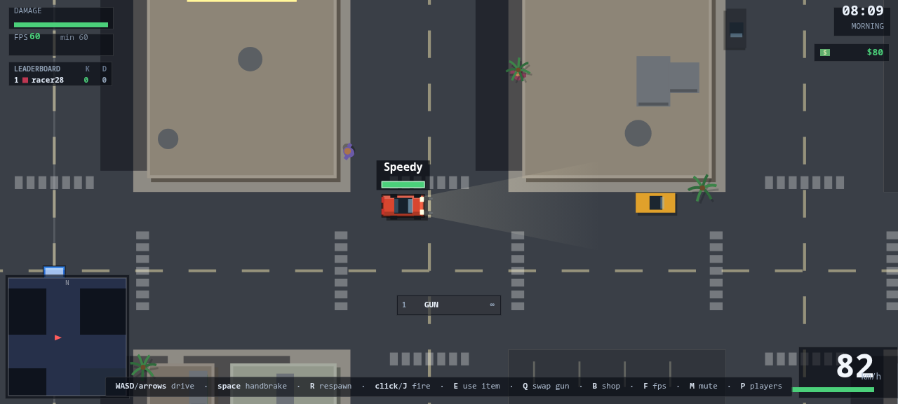

# Leonida

A top-down driving game in the spirit of GTA 2, in one HTML file. No build step,
no dependencies, no assets — every texture is drawn with canvas paths.

## Running it

    node server.js          # port 80
    PORT=8080 node server.js

Port 80 needs root on Linux and macOS; `PORT=8080` avoids that. Then open the
address it prints. Everyone who opens that address is in the same game — there
are no room codes and no lobbies. To play with someone else, they open the same
address on the same network.

If you only want to drive around on your own, opening `index.html` directly works
too — you just get no other players.

Add `?audio=0` to the URL for a silent tab — no `AudioContext` is ever built. The
automated browser tests append it so headless Chrome never plays anything.
## Controls

| | |
|---|---|
| **WASD** / arrows | drive |
| **space** | handbrake (the way to drift) |
| **click** / **J** | fire |
| **E** | use the held item |
| **Q** / **1-9** | swap gun / pick a gun from the arsenal |
| **B** | shop |
| **P** | players, scores and your name |
| **F** | fps counter |
| **M** | mute |
| **R** | respawn |

On a phone the controls are on screen: steering and handbrake on the left,
throttle, brake, fire and item on the right. Any button can be dragged somewhere
more comfortable, and that position is remembered. The buttons down the
top-right are players/name, shop, fullscreen and reset-the-controls.

## What is in it

**Driving.** Arcade handling with real weight to it: forward thrust, speed-scaled
steering, and a separate lateral grip term so the car slides when you pull the
handbrake. The physics step is fixed at 120Hz, so how it behaves does not depend
on your frame rate.

**A city.** Laid out on a seeded grid, so every client builds exactly the same
streets. Blocks are buildings or open lots, with pavements, crossings, palms,
parked cars, street lights and a beach and ocean around the edge. Buildings are
lit by a day/night cycle: shape the whole scene with one multiply pass, then add
the light sources on top.

**Destruction.** Bullets chip buildings, walls show the damage, and enough of it
turns one into rubble you can drive over. Explosions carve holes in whatever they
happen beside. Parked cars blow up. Palms flatten. Every break is broadcast, so
the city comes apart the same way on everyone's screen.

**Pedestrians.** They walk the pavements and run when a car comes at them. Run
one down, or shoot them, and they drop cash you collect by driving over it.
They come back after a while.

**The shop.** Money buys permanent upgrades to engine, armour, nitro, tyres and
guns. There is no level cap — each level costs more than the last — and your
money and levels are kept between visits.

**Weapons.** Seventeen of them, in the general spirit of Liero: the default gun,
an SMG, shotgun, cannon, RPG, homing missile, sniper, minigun, grenades that
bounce off walls on a fuse, napalm and flame that set the ground burning, a
railgun that goes straight through things, and cluster shells that burst into
bomblets. They turn up in item boxes around the city, which show what is inside.
You can carry several and swap between them.

**Items.** Boost, shield, repair, mine and nuke, alongside the guns. Repairs
patch you up the moment you touch them.

**Multiplayer.** Everyone on the server shares one game. Each player simulates
their own car and broadcasts it, so nobody else's car is ever rubber-banded —
what you see is what they did. Contact is reconciled between the two players
involved; bullets are fired locally and the hit is reported to whoever it
landed on. The relay only introduces players and forwards packets; there is no
authoritative server simulating the world.

**Death.** The screen drains to black and white and WASTED lands over it, GTA
style, then you respawn somewhere random that is not a corner.

## The relay

`server.js` serves the page and forwards messages between players over a
WebSocket. It has no dependencies either — the WebSocket frame handling is about
a hundred lines. It keeps the roster, the scoreboard and the world seed, and it
tells every client to reload when `index.html` changes, so an edit is live
everywhere without anyone refreshing.

    SEED=123 node server.js     # a fixed city, useful when testing

Pressing `r` + Enter in the server console forces a refresh. So does
`GET /reload`, but that now needs the token the server prints at startup, since
an unauthenticated reload would let anyone on the network restart everyone's
game on a loop:

    curl "http://localhost:8080/reload?token=<printed-token>"

### Security

The relay is written to be safe to expose. Each connection gets a message-rate
budget (90/s sustained) and a blow-up carve-out, one address may hold at most 4
connections, and the total is capped. Malformed requests and malformed WebSocket
frames are rejected without touching the process; earlier, a single `GET /%`
could take the server down. Only `index.html` and image files in the folder are
served — the relay's source, the tests and dotfiles stay private even though they
sit in the same directory.

Traffic is plain HTTP by default. Point `TLS_KEY` and `TLS_CERT` at a certificate
to serve HTTPS/WSS directly, or put the relay behind a proxy:

    TLS_KEY=key.pem TLS_CERT=cert.pem node server.js

Kill attribution is *best-effort*, not verified: each client simulates its own
car and blast damage is applied on the victim's machine, so a modified client can
still claim a kill it did not earn. The relay prefers the hit it actually
forwarded over anything a client claims, but it cannot make a client-authoritative
game tamper-proof.

`TOKEN` overrides the generated reload token.

## Tests

    node tests/run-all.js

Sixteen game suites, roughly 450 assertions, plus `tests/audit.js`. They run the
real page: the node suites stub the DOM and canvas and exercise the logic, and
the browser suites drive real Chrome over the DevTools protocol. The runner
extracts the script from `index.html` and starts a relay on 8099 with a fixed
seed. See [tests/README.md](tests/README.md) for what each suite covers.

`tests/audit.js` is a security audit rather than a game test: each probe starts a
throwaway relay and attacks it — malformed URLs, path traversal, unmasked and
fragmented frames, message floods, connection exhaustion, forged kills, a
cross-origin reload — then reports which of them the server survives. Run it on
its own to see the findings:

    node tests/audit.js

Screenshots from the browser suites land in `tests/shots/`.

## Layout

    index.html      the whole game
    server.js       static files + the WebSocket relay
    tests/          the suites, the runner and the screenshots

The game is one `<script>` block, ordered from the bottom up: helpers, world
generation, the car, input, collision, physics, then the render passes and the
HUD last.
